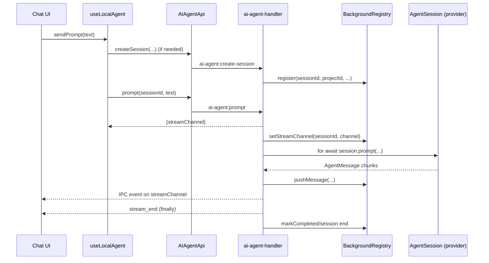

# Bfloat Agent Session Architecture Findings

## Overview
The desktop app uses a split architecture:
- **Runtime session execution + stream fanout** happen in Electron main process.
- **Session metadata (tabs/history labels)** is persisted via web API + Postgres.
- **Conversation content** is sourced from local CLI session files (Claude/Codex), not DB.

```mermaid
flowchart LR
  UI[Chat.tsx + SessionTabs.tsx\nrenderer] --> Hook[useLocalAgent.ts]
  Hook --> API[AIAgentApi\nIPC client]
  API --> Main[ai-agent-handler.ts\nElectron main]
  Main --> Mgr[DefaultAgentManager\nin-memory sessions]
  Mgr --> Providers[Claude/Codex/Bfloat providers]
  Main --> Reg[BackgroundSessionRegistry\nin-memory]
  UI --> WebAPI[/api/projects/:id/sessions\nmetadata only]
  WebAPI --> DB[(AgentSession table)]

  Providers --> CLI[(Local CLI runtimes)]
  CLI --> Files[(Session files\n~/.codex / Claude storage)]
  UI --> Read[readSession/listSessions IPC]
  Read --> Files
```

## Stream Lifecycle



## Key Technical Facts
1. Runtime sessions are in-memory (`activeSessions`) in main process.
2. DB `AgentSession` is tab metadata (`sessionId`, provider, name, timestamps), not stream runtime.
3. Stream channel is per-prompt (`ai-agent:stream:<sessionId>:<timestamp>`), not static per session.
4. Renderer hook maintains a single active stream listener (`unsubscribeRef`).
5. New session and tab switches call `detach()` (unsubscribe + clear local state) without stopping main-process session.

## Why Streaming Is Finicky (Likely Root Causes)
1. **Reconnect race on fast tab/session switches**
   - Reconnect requires `status === running` and non-null `streamChannel`.
   - `streamChannel` is set asynchronously (`setImmediate`) after prompt begins.
   - One-shot reconnect can miss this window and never retry.

2. **Buffered messages are not replayed on reconnect**
   - Main registry buffers messages, but hook intentionally does not replay them.
   - Detach during active streaming can permanently drop chunks from UI view.

3. **Single active listener in renderer**
   - Multiple sessions can run in main process, but renderer only actively listens to one stream channel at a time.
   - Switching tabs during active output can appear like “broken stream” for the hidden session.

4. **Session cache staleness can muddy session selection UX**
   - Session queries are cached with 5-minute stale windows.
   - This can produce confusing “latest session” restoration behavior around rapid switching/new-session flows.

## Current State Model (ASCII)

```text
[IDLE]
  -> sendPrompt
[STREAMING(attached)]
  -> switch tab/new session => detach()
[STREAMING(detached in main)]
  -> select tab => reconnectToSession(one-shot)
      -> success: [STREAMING(attached)]
      -> fail (race/no channel): [DETACHED + no live updates]
  -> complete in background => [COMPLETED]
```

## Architecture Improvements for Reliable Multi-Session Streaming
1. Add reconnect retry/backoff when session is running but channel is not yet published.
2. Replay buffered messages from registry on reconnect.
3. Introduce per-session stream cursor/sequence IDs and resume-from-cursor semantics.
4. Replace single-listener renderer model with session-scoped listeners (or a central stream broker).
5. Expose explicit UI session stream states: `attached`, `detached`, `reconnecting`, `stale`.

## Relevant File References
- `packages/workbench/src/components/chat/Chat.tsx`
- `packages/workbench/src/hooks/useLocalAgent.ts`
- `apps/desktop/lib/conveyor/handlers/ai-agent-handler.ts`
- `apps/desktop/lib/agents/background-registry.ts`
- `apps/desktop/lib/agents/manager.ts`
- `apps/desktop/lib/conveyor/api/ai-agent-api.ts`
- `apps/web/app/routes/api.projects.$id.sessions.ts`
- `packages/workbench/src/hooks/useProjectQuery.ts`
- `packages/workbench/src/components/project/ProjectContent.tsx`
